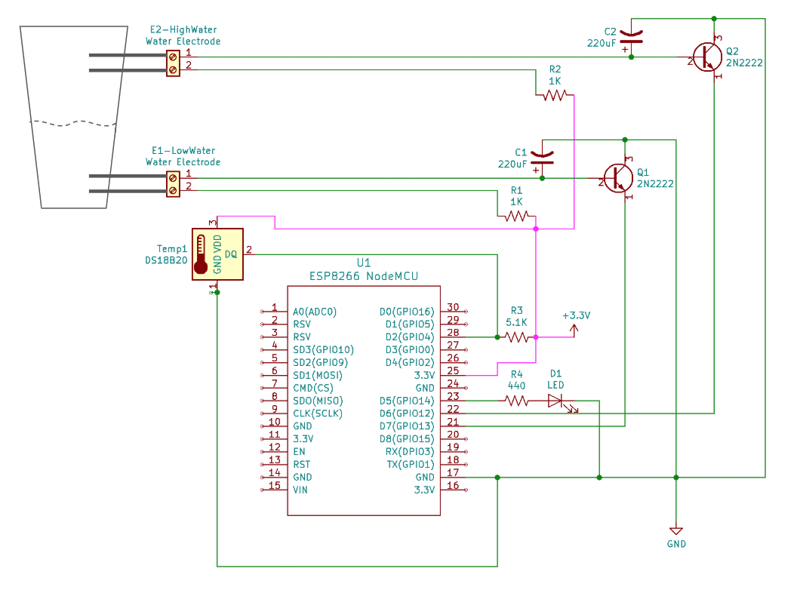

# WaterDetectorWiFi
ESP8266 NodeMCU Based IoT Water Detector with Temperature Probe

## Description
This project describes how to build a device to detect water and post the status to a URL or MQTT endpoints. 
We will use a ESP8266 NodeMCU Arduino based controller with a simple water detection circuit using a 2N2222 NPN transitor, 
1K ohm reistor and a 100uF electrolytic capacitor (with optional LED for indicator).  Multiple water probes can be added to measure water level.

Optional temperature probe: Adding a DS18B20 One-Wire bus temperature sensor to read and send current temperature.

## Circuit
This project is based on the amazing low-cost WiFi enable ESP8266 NodeMCU controller.  We will use the GPIO digital ports, specifically:
* GPIO 13 (pin D7) - Water Sensor #1
* GPIO 12 (pin D6) - Water Sensor #2
* GPIO 14 (pin D5) - External LED Indicator
* GPIO  4 (pin D2) - OneWire Bus for DS18B20 Temperature Probe

### Water Sensors (2)
* E1 & E2 - Water resistant 2 prong electrodes 
* R1 & R2 - 1K ohm reistors 
* C1 & C2 - 220uF electrolytic capacitors 
* Q1 & Q2 - NPN Transitor (e.g. 2N2222)

The capacitor provides signal stability and the capacitance can vary depending upon how long you want the sensor to register after the water is detected removed.  For my application, I expect water waves across the sensor so I want to hold the signal high as soon a crests of the waves start making contact with the electrode.  By using a 220uF capacitor once the first detection is made it will hold the signal high for 5 seconds, preventing signal oscillation. 

### Temperature Sensor (1)
* Temp1 - DS18B20 temperature sensor (recommend waterproof probe) 
* R3 - 5.1K ohm resistor

### Alert LED (1)
* D1 - Standard Red LED - Could be replaced with buzzer
* R4 - 400 ohm resistor

## Code
Arduino IDE Requirements:
1. You should be able to program your ESP8266 from the Arduino IDE.  
2. Open your Arduino IDE and go to Sketch > Include Library > Manage Libraries and add:
    * One Wire Library
    * Dallas Temperature Sensor library
3. Open [ESP8266WaterDetector.ino](ESP8266WaterDetector.ino) source code.

## Reference
ESP8266 NodeMCU - Amazon: https://www.amazon.com/gp/product/B07XVKJ36C/ref=ppx_yo_dt_b_search_asin_title?ie=UTF8&psc=1
Water Induction Electrode - Amazon: https://www.amazon.com/gp/product/B014SACDSO/ref=ppx_yo_dt_b_search_asin_title?ie=UTF8&psc=1
DS18b20 Waterproof Temperature Sensors - Amazon: https://www.amazon.com/gp/product/B00CHEZ250/ref=ppx_yo_dt_b_search_asin_title?ie=UTF8&psc=1

